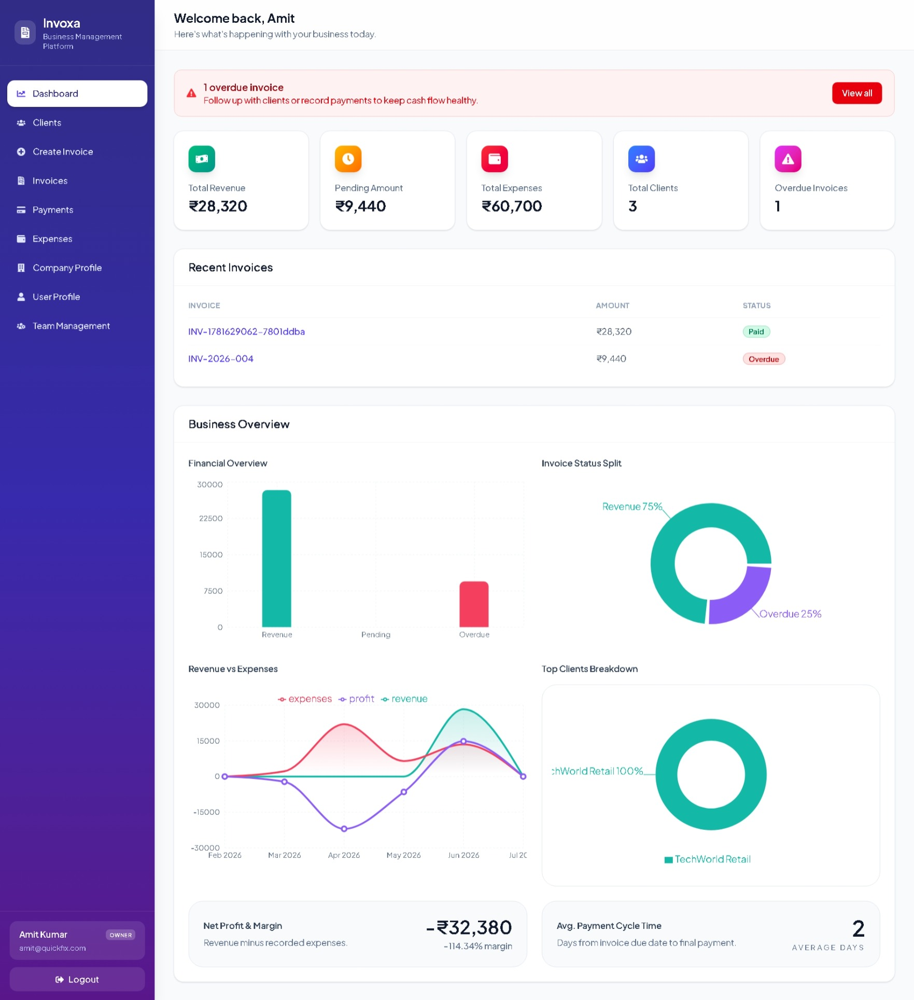
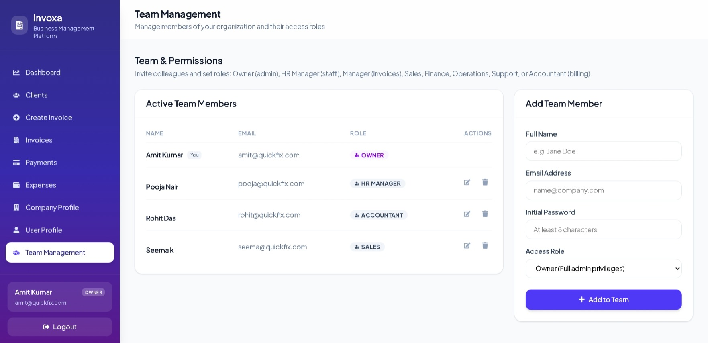
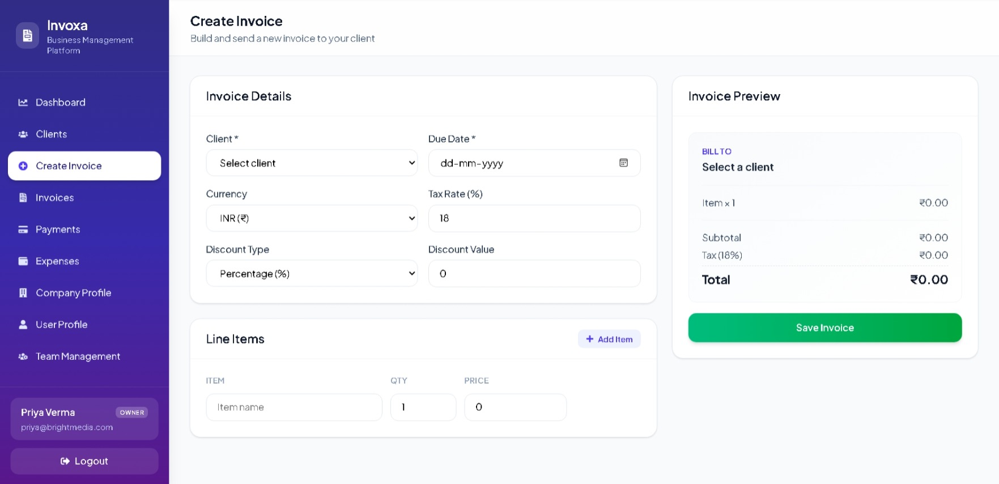
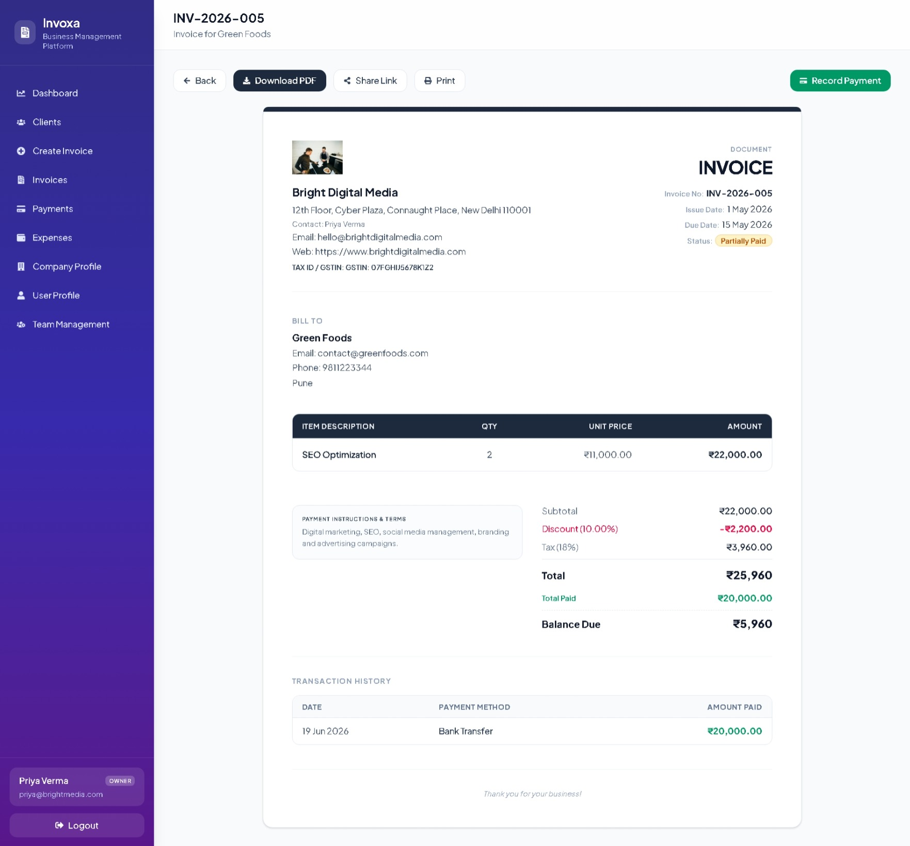
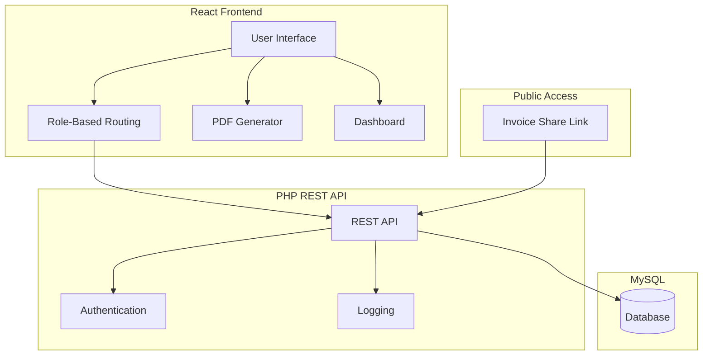

# 💼 Invoxa

<table>
<tr>
<td width="180">

</td>

<td width="900" align="center">
<h1>Invoxa</h1>
<h3><em>Invoice, Payment & Expense Management System</em></h3>
</td>
</tr>
</table>

<p align="center">
   &nbsp;&nbsp;&nbsp;
   &nbsp;&nbsp;&nbsp;
   &nbsp;&nbsp;&nbsp;
   &nbsp;&nbsp;&nbsp;
  
  
</p><br>

## 📝 Project Introduction

**Invoxa** is a secure, modern, multi-role financial administration system designed to streamline invoicing, payment logging, and expense tracking for small-to-medium businesses. Built on a client-server architecture using **React 19**, **Vite 8**, **Tailwind CSS v4**, and a lightweight **PHP REST backend**, Invoxa allows companies to manage their cashflow, issue tax-compliant invoices, and manage team members with granular permissions.
<br>


## 📸 Screenshots

| Dashboard Analytics | Team & Role Management |
|:-------------------:|:----------------------:|
|  |  |

| Invoice Creation | Invoice Details |
|:----------------:|:---------------:|
|  |  |

<br>


## 📽️ Demo

Watch a complete walkthrough of Invoxa, including authentication, dashboard analytics, invoice creation, expense tracking, payment management, and PDF generation.

🎥 **[Watch the Invoxa Demo Video](https://drive.google.com/file/d/1Mo42K9BWlrNwoPRhH5gkf6N6slOUzccU/view?usp=sharing)**

<br>


## ✨ Features

### 💻 Frontend

- **Analytics Dashboard:** Interactive charts and financial insights using **Recharts**.
- **Invoice Management:** Create multi-item invoices with automatic subtotal, tax, discount, and currency calculations.
- **PDF Export:** Generate professional invoices using **jsPDF** and **jspdf-autotable**.
- **Client & Expense Management:** Manage clients, payments, and categorized business expenses.
- **Role-Based Interface:** Protected routes and dashboards tailored to different user roles.

### ⚙️ Backend

- **REST API:** Handles authentication, invoices, clients, payments, and expenses with JSON-based communication.
- **Role-Based Authorization:** Validates user permissions and secures API endpoints.
- **Database Management:** Stores users, companies, invoices, payments, and expenses in **MySQL**.
- **Public Invoice Sharing:** Generates secure invoice links using unique `public_token` values.
- **Database Migration:** Automatically initializes and updates the database schema using `migrate.php`.

<br>

## 🛠️ Tech Stack

- **Frontend:** React 19, Vite, Tailwind CSS
- **Backend:** PHP REST API
- **Database:** MySQL
- **Libraries:** Axios, React Router DOM, Recharts, jsPDF

<br>

## 📐 System Architecture

Invoxa follows a **client-server architecture** where the React frontend communicates with the PHP backend through REST APIs. The backend processes business logic, manages user authentication, and stores application data in MySQL.



### Component Integration & Runtime Flow

1. **Authentication:** Users sign in and the backend validates their credentials and permissions.
2. **Business Operations:** Users create invoices, manage clients, record payments, and track expenses.
3. **Data Management:** The backend processes requests and stores all business data in MySQL.
4. **Dashboard & Reports:** Financial data is displayed through interactive dashboards and exported as PDF invoices.
5. **Public Invoice Access:** Secure share links allow clients to view invoices without logging in.

<br>

## 📂 Project Structure

```text
Invoxa/
├── frontend/                 # React frontend
│   ├── package.json          # Project dependencies
│   ├── vite.config.js        # Vite configuration
│   ├── eslint.config.js      # ESLint configuration
│   ├── index.html            # Application entry
│   ├── image/                # Screenshots & icons
│   └── src/
│       ├── components/       # Reusable UI
│       ├── context/          # Authentication context
│       ├── pages/            # Application pages
│       ├── routes/           # Protected routes
│       ├── services/         # API services
│       └── utils/            # Utility functions
│
├── backend/                  # PHP backend
│   ├── api/                  # REST endpoints
│   └── config/               # Database & configuration
│
└── db.sql                    # Database schema
```

<br>


## 🚀 Installation & Setup

### Prerequisites

Ensure the following software is installed before running the project:

- PHP 8.0+
- MySQL 8.0+ (or MariaDB)
- Node.js 18+ and npm
- XAMPP (Apache & MySQL)
- A code editor (e.g., Visual Studio Code)


### 1. Clone the Repository

```bash
git clone https://github.com/Rdeepthiacharya/Invoxa.git
cd Invoxa
```


### 2. Set Up the Database

```sql
CREATE DATABASE invoxa;
```

Import `db.sql` into the `invoxa` database using **phpMyAdmin**.


### 3. Configure the Backend

Move the project to your web server directory (e.g., `C:/xampp/htdocs/Invoxa/`).

Update the database configuration in `backend/config/db.php`, then run:

```text
http://localhost/Invoxa/backend/api/migrate.php
```


### 4. Launch the Application

Open the project in your preferred code editor and navigate to the `frontend` directory:

```bash
cd frontend
```

Install the project dependencies:

```bash
npm install
```

Start the development server:

```bash
npm run dev
```

> **Note:** Start **Apache** and **MySQL** from **XAMPP** before running the application.

<br>

## 📄 License

This project is licensed under the MIT License. See the [LICENSE](LICENSE) file for details.

<br>

<p align="center">
<strong>💼 Invoxa</strong> · Built with React, PHP, and MySQL
</p>
